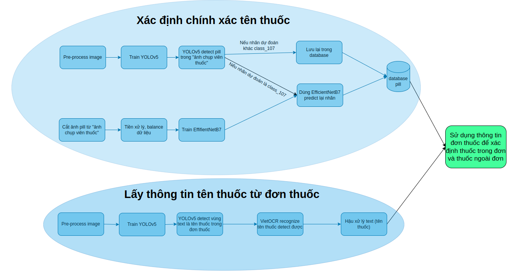

# <center>VAIPE: Medicine Pill Image Recognition Challenge</center>

Cuộc thi do Trung tâm Y tế thông minh VinUni-Illinois thuộc trường ĐH VinUni, Trung tâm Nghiên cứu Quốc tế về Trí tuệ nhân tạo BKAI, Đại học Bách khoa Hà Nội, phối hợp cùng Bộ Khoa học và Công nghệ và Báo VnExpress tổ chức.

Tuy không đạt đươc giải cao trong cuộc thi lần này, nhưng team mình muốn chia sẻ giải pháp tới mọi người.


## 1. Mô tả bài toán

### Input: 
- 1 ảnh đơn thuốc

<center>

</center>

- n "ảnh chụp viên thuốc" (Xét cho đơn thuốc trên)

<!--  -->
<center>


</center>

### Output: 
Với mỗi "ảnh chụp viên thuốc", xét xem những viên thuốc nào nằm trong đơn (xác định tên thuốc, vị trí), viên thuốc nào không nằm trong đơn (xác định vị trí).

Thông tin thêm: 
- Có 107 loại thuốc được xét là thuốc trong đơn, được gán theo thứ tự là class_0, class_1, ..., class_106.
- Các loại thuốc không nằm trong đơn đang xét thì được gán là thuốc ngoài đơn class_107. Thuốc ngoài đơn có thể bao gồm 107 loại thuốc trong đơn và các thuốc khác.
Ví dụ: 
    * Đơn thuốc 1, có 2 loại thuốc: "paracetamol 500mg" và "normagut 250mg". Nếu trong những "ảnh chụp viên thuốc" có thuốc "paracetamol 500mg" thì nó là thuốc trong đơn.
    * Xét tiếp đơn thuốc 2 có 1 loại thuốc: "meloxicam 7,5mg". Nếu trong số những "ảnh chụp viên thuốc" có thuốc "paracetamol 500mg" thì trong trường hợp này viên thuốc "paracetamol 500mg" đươc gán nhãn ngoài đơn.

## 2. Pipeline

<center>

</center>

## 3. Cách cài đặt code

### 1. Clone source code và setup môi trường
- Clone source code:

```
git clonehttps://github.com/lynguyenminh/VAIPE2022.git
cd VAIPE2022
```

- Setup môi trường: 

```
pip install -r requirements.txt # Nếu máy có gpu
hoăc: 
pip install -r requirements.txt --no-cache-dir # Nếu không có gpu
```
### 2. Inference
```
sh gen_result_with_cpu.sh # Nếu máy không có gpu

sh gen_result_with_gpu.sh # Nếu máy có gpu
```

